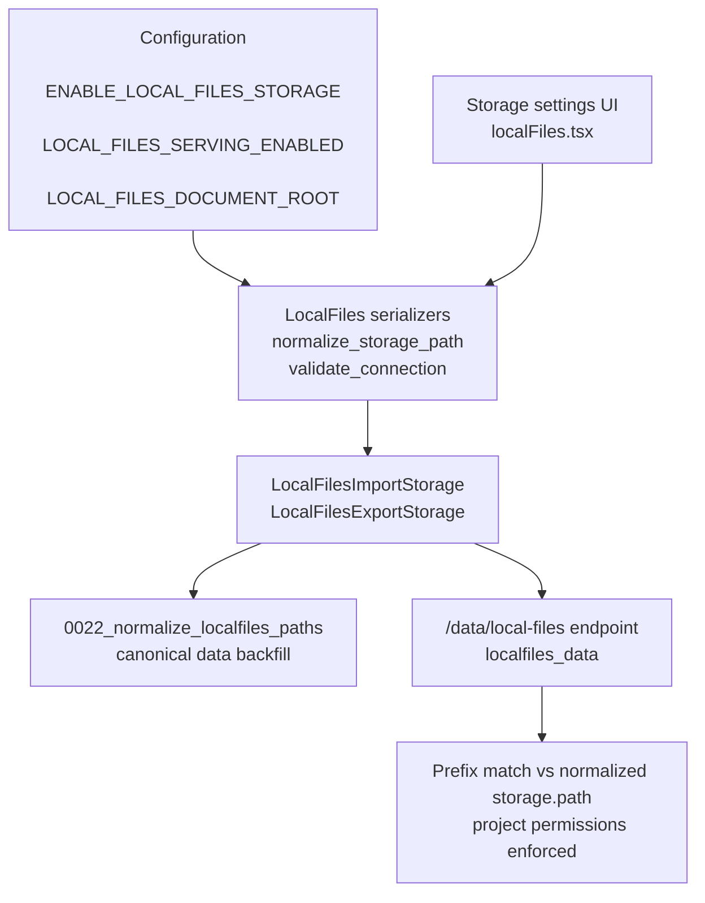

# Local Files Storage

## Overview
Local Files storage allows self hosted Label Studio deployments to serve and synchronize media files directly from the host file system. Projects can reference files with URLs such as `/data/local-files/?d=dataset/image.jpg`, while the backend enforces that every requested path stays inside `LOCAL_FILES_DOCUMENT_ROOT` and that only users with access to the corresponding storage project can download the file. The feature is disabled by default because serving arbitrary local files is a security risk; administrators must opt in via environment variables and project settings.

## Architecture


## Key Features
- **Canonical paths everywhere**: `normalize_storage_path` trims whitespace, converts backslashes, collapses duplicate separators, and runs `os.path.normpath` before any storage is saved or validated.
- **Safety checks**: `validate_connection` rejects paths outside `LOCAL_FILES_DOCUMENT_ROOT`, paths equal to the document root, and any configuration made while `LOCAL_FILES_SERVING_ENABLED` is false.
- **Efficient serving**: `/data/local-files` uses a database level prefix filter (`_full_path__startswith=F('path')`) plus per project permission checks so it scales to thousands of storages.
- **Actionable validation errors**: serializers convert nested Django/DRF error payloads into plain dictionaries/lists for the UI, so users see the exact reason a storage path failed validation.
- **UI guidance**: the React provider warns when local serving is disabled, suggests default paths, and reminds users to mount host directories in Docker-based setups.

## Usage

### Configuration and environment variables
1. **Where settings come from**:<br/>
   - `ENABLE_LOCAL_FILES_STORAGE` controls whether Local Files appears as a storage type in the UI (defaults to `true`).<br/>
   - `LOCAL_FILES_SERVING_ENABLED` and `LOCAL_FILES_DOCUMENT_ROOT` are read via `get_env` / `get_bool_env`, which look at three names in order: `LABEL_STUDIO_<NAME>`, `HEARTEX_<NAME>`, and `<NAME>` itself. For example, all of these are valid and equivalent:<br/>
     - `LABEL_STUDIO_LOCAL_FILES_DOCUMENT_ROOT=/absolute/path/to/data`<br/>
     - `HEARTEX_LOCAL_FILES_DOCUMENT_ROOT=/absolute/path/to/data`<br/>
     - `LOCAL_FILES_DOCUMENT_ROOT=/absolute/path/to/data`.<br/>
   - If no document root is configured, Django falls back to the filesystem root (`/`), but Local Files will still be unusable until you either set a safer root or allow Community auto detection to override it.
2. **Community auto detection**:<br/>
   - In the Community edition, when *both* `LOCAL_FILES_DOCUMENT_ROOT` and `LOCAL_FILES_SERVING_ENABLED` are unset, `core.settings.base` calls `autodetect_local_files_root()` from `localfiles.functions`.<br/>
   - This helper searches for existing `mydata` or `label-studio-data` directories relative to the current working directory. If it finds one, it sets `LOCAL_FILES_DOCUMENT_ROOT` to that path and turns `LOCAL_FILES_SERVING_ENABLED` on automatically, logging a short hint to the console.<br/>
   - Error messages from `validate_connection()` and the Local Files UI both reference this behavior so operators understand why Local Files may have turned on “by itself” in a fresh Community install.
3. **Explicit enablement (recommended for production)**:<br/>
   ```bash
   export LABEL_STUDIO_LOCAL_FILES_SERVING_ENABLED=true
   export LABEL_STUDIO_LOCAL_FILES_DOCUMENT_ROOT=/absolute/path/to/data
   ```<br/>
   Restart Label Studio after exporting the variables (or configure them through your process manager).

### Creating and using a Local Files storage
4. **Prepare the directory tree**:<br/>
   - The document root must exist on the host machine.<br/>
   - Each storage path must be a subdirectory of the document root (for example `/absolute/path/to/data/dataset_a`).<br/>
   - Use POSIX forward slashes in task data (`/data/local-files/?d=dataset_a/image_1.jpg`). The backend will normalize Windows style paths when you configure the storage.
5. **Configure the storage in the UI** (`Settings → Storage → Add Source Storage → Local files`):<br/>
   - The form reads `window.APP_SETTINGS.local_files_document_root` so it can suggest a default path and placeholder like `"<document_root>/your-subdirectory"`.<br/>
   - The schema enforces a non empty absolute path and the description reminds the user that the path must start with the configured document root to pass backend validation.<br/>
   - If `LOCAL_FILES_SERVING_ENABLED` is false, a destructive alert explains how to enable it. Community Edition users get extra tips about `mydata` and `label-studio-data` convenience folders both for bare metal and containers.
6. **Verify access**:<br/>
   - After saving the storage, open `http(s)://<host>/data/local-files/?d=<relative/path>` in a browser. Successful loads confirm both permissions and hostname level CORS settings.<br/>
   - When importing tasks manually, remember to use relative URLs (everything after `/data/local-files/?d=`). The backend joins this relative segment with `LOCAL_FILES_DOCUMENT_ROOT` via `safe_join` and then ensures the resulting directory matches at least one storage path prefix before serving the file.

## API Reference
- `LocalFilesImportStorage` and `LocalFilesExportStorage` live in `models.py` and inherit from `ProjectStorageMixin`. The import storage generates either blob URLs or JSON tasks depending on configuration.
- REST endpoints for CRUD, sync, and form layout are defined in `api.py` and exposed under `/api/storages/localfiles/...`.
- `/data/local-files/` (see `core/views.py`) is the only endpoint that serves binary content. It requires authentication and re-checks both project permissions and on-disk existence every request.

## Development
- Key files:<br/>
  - `models.py`: storage models, normalization helper, and validation logic.<br/>
  - `serializers.py`: DRF serializers that call `normalize_storage_path` and convert validation errors via `_stringify_detail`.<br/>
  - `migrations/0022_normalize_localfiles_paths.py`: data migration that retrofits canonical paths for existing storages without importing models at import time.<br/>
  - `web/apps/labelstudio/src/pages/Settings/StorageSettings/providers/localFiles.tsx`: frontend provider that surfaces environment state and default path hints.<br/>
  - `tests/test_localfiles_serializers.py`, `tests/test_localfiles_view.py`, and `tests/test_localfiles_validation.py`: cover serializers, `/data/local-files` endpoint, and `validate_connection`.
- Canonical path logic is intentionally duplicated inside the migration to avoid importing Django models when apps are not ready. Keep any future migrations copy-paste aligned with `normalize_storage_path`.
- When adding new local storage features, update both backend validation (ideally in one shared mixin) and the UI provider so users see consistent guidance.

## Other Points
- **Security**: Always keep `LOCAL_FILES_SERVING_ENABLED` false in public multi tenant deployments. Serving local files bypasses media storage authentication, so only trusted operators should enable it.
- **Docker considerations**: The default container runs Label Studio from `/label-studio`. Mount host folders to `/label-studio/mydata` or `/label-studio/label-studio-data` to take advantage of the auto enablement logic described in the UI.
- **Error diagnostics**: Users can manually open `/data/local-files/?d=relative/path` in the browser to triage 403 vs 404 issues. 403 usually means missing permissions or disabled serving; 404 means the file path does not map to any registered storage or the file no longer exists on disk.

